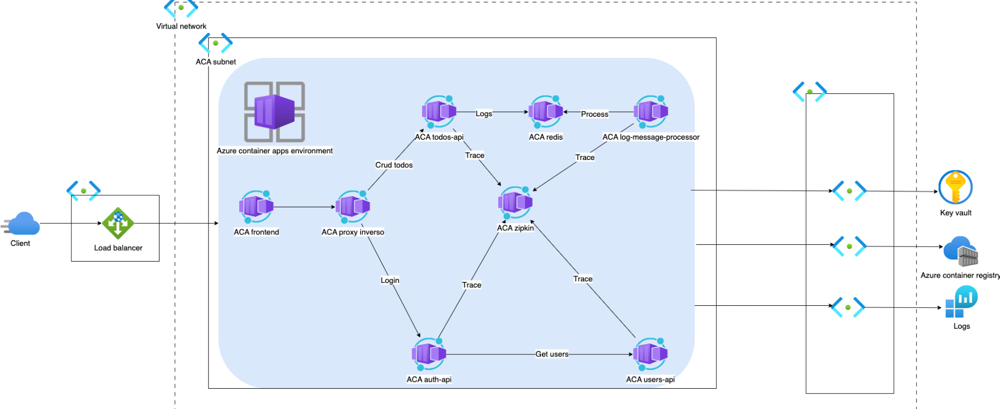
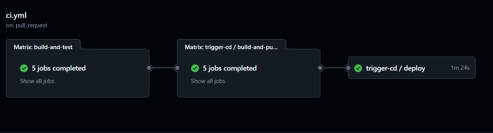
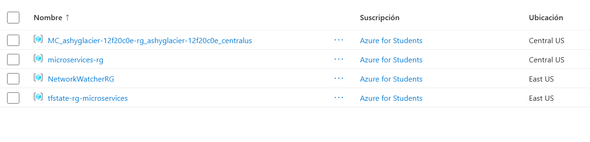
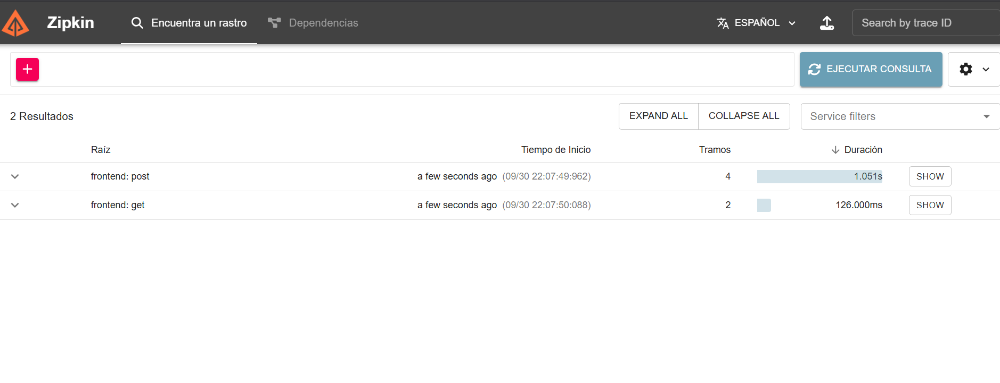
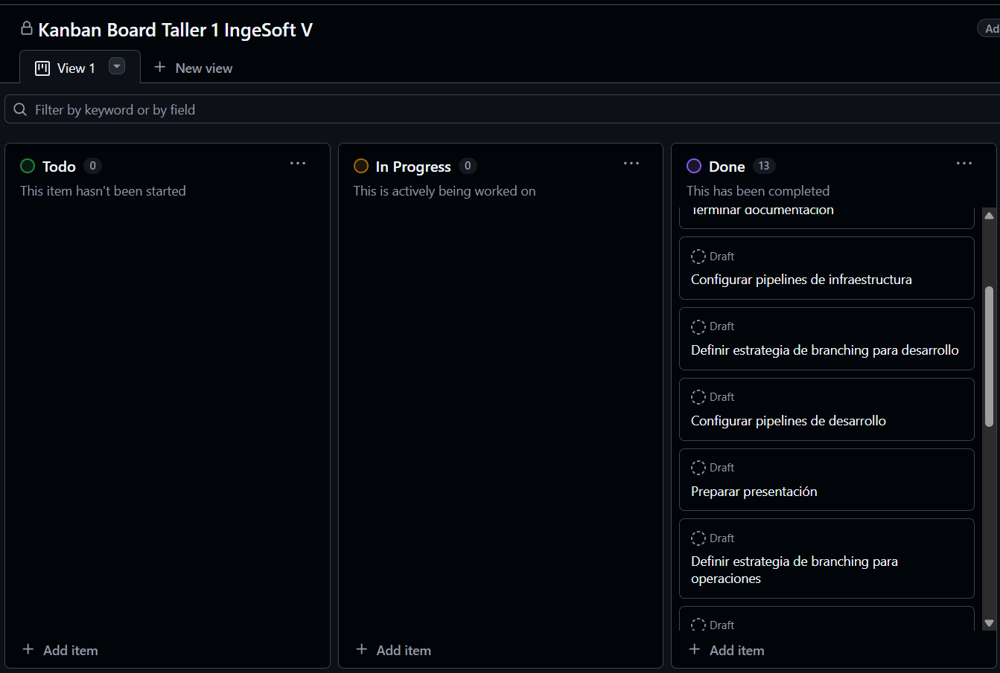

# 🚀 Microservice App - PRFT DevOps Training

## 📋 Tabla de Contenidos
- [Descripción del Proyecto](#descripción-del-proyecto)
- [Arquitectura](#arquitectura)
- [Componentes](#componentes)
- [Tecnologías Utilizadas](#tecnologías-utilizadas)
- [Infraestructura como Código (IaC)](#infraestructura-como-código-iac)
- [CI/CD Pipeline](#cicd-pipeline)
- [Despliegue en Azure](#despliegue-en-azure)
- [Observabilidad y Trazabilidad](#observabilidad-y-trazabilidad)
- [Metodología de Trabajo](#metodología-de-trabajo)
- [Guía de Instalación y Despliegue](#guía-de-instalación-y-despliegue)
- [Costos y Recursos de Azure](#costos-y-recursos-de-azure)

---

## 📖 Descripción del Proyecto

Este proyecto es una **aplicación de microservicios** diseñada para demostrar las mejores prácticas de DevOps, incluyendo:

- **Arquitectura de microservicios** con componentes independientes
- **Infraestructura como Código (IaC)** con Terraform
- **Pipelines CI/CD** con GitHub Actions
- **Containerización** con Docker
- **Despliegue en la nube** usando Azure Container Apps
- **Observabilidad distribuida** con Zipkin
- **Gestión de colas** con Redis

La aplicación consiste en un sistema de gestión de TODOs donde diferentes microservicios trabajan en conjunto para proporcionar funcionalidades de autenticación, gestión de usuarios, CRUD de tareas, y procesamiento de logs.

---

## 🏗️ Arquitectura

### Diagrama de Arquitectura



### Descripción de la Arquitectura

La aplicación sigue una **arquitectura de microservicios** donde cada componente tiene una responsabilidad específica:

1. **Frontend (Vue.js)**: Interfaz de usuario que se comunica con los APIs backend
2. **Auth API (Go)**: Servicio de autenticación que genera tokens JWT
3. **Users API (Java Spring Boot)**: Gestión de perfiles de usuario
4. **TODOs API (Node.js)**: CRUD de tareas y publicación de eventos en Redis
5. **Log Message Processor (Python)**: Procesador de cola que consume mensajes de Redis
6. **Redis**: Base de datos en memoria para colas de mensajes
7. **Zipkin**: Sistema de trazabilidad distribuida

### Flujo de Comunicación

```
Usuario → Frontend → Auth API → Users API
                  ↓
                TODOs API → Redis → Log Message Processor
                  ↓
                Zipkin (trazas)
```

---

## 🧩 Componentes

### 1. Frontend (Vue.js)
- **Tecnología**: Vue.js 2.x, Nginx
- **Puerto**: 8080 (desarrollo), 80 (producción)
- **Función**: Interfaz de usuario para gestión de TODOs
- **Comunicación**: REST API con Auth API y TODOs API


**Características**:
- Autenticación con JWT
- Gestión de tareas (crear, leer, eliminar)
- Diseño responsive con Bootstrap

### 2. Auth API (Go)
- **Tecnología**: Go (Golang) con Echo Framework
- **Puerto**: 8000
- **Función**: Autenticación de usuarios y generación de tokens JWT
- **Endpoints**:
  - `POST /login` - Autenticación de usuarios
  - `GET /version` - Versión del servicio

**Características**:
- Circuit breaker pattern con `gobreaker`
- Validación de credenciales contra Users API
- Tokens JWT con expiración configurable

### 3. Users API (Java Spring Boot)
- **Tecnología**: Java 8, Spring Boot 1.5.6
- **Puerto**: 8083
- **Función**: Gestión de perfiles de usuario
- **Endpoints**:
  - `GET /users` - Lista todos los usuarios
  - `GET /users/:username` - Obtiene un usuario específico

**Características**:
- Usuarios hardcoded para demo
- Integración con Zipkin para trazas
- Auto-scaling basado en CPU

### 4. TODOs API (Node.js)
- **Tecnología**: Node.js, Express
- **Puerto**: 8082
- **Función**: CRUD de tareas y logging de operaciones
- **Endpoints**:
  - `GET /todos` - Lista TODOs del usuario
  - `POST /todos` - Crea un nuevo TODO
  - `DELETE /todos/:taskId` - Elimina un TODO

**Características**:
- Almacenamiento en memoria con `memory-cache`
- Publicación de eventos CREATE/DELETE en Redis
- Validación JWT
- Trazas distribuidas con Zipkin

### 5. Log Message Processor (Python)
- **Tecnología**: Python 3.6+, Redis client
- **Función**: Consumidor de cola Redis que procesa logs
- **Características**:
  - Suscripción al canal `log_channel` de Redis
  - Impresión de mensajes en stdout
  - Configuración con variables de entorno

### 6. Redis
- **Tecnología**: Redis 7 Alpine
- **Puerto**: 6379
- **Función**: Cola de mensajes para logging asíncrono
- **Características**:
  - Persistencia en memoria
  - Pub/Sub para mensajes de log

### 7. Zipkin
- **Tecnología**: OpenZipkin
- **Puerto**: 9411
- **Función**: Trazabilidad distribuida
- **Características**:
  - Recolección de trazas de todos los servicios
  - UI para visualización de trazas
  - API para ingesta de spans


---

## 💻 Tecnologías Utilizadas

### Lenguajes y Frameworks
| Componente | Tecnología | Versión |
|------------|-----------|---------|
| Frontend | Vue.js, Nginx | 2.x |
| Auth API | Go, Echo | 1.18+ |
| Users API | Java, Spring Boot | 8, 1.5.6 |
| TODOs API | Node.js, Express | 8.17.0 |
| Log Processor | Python | 3.6+ |

### Infraestructura y DevOps
- **Containerización**: Docker, Docker Compose
- **Orquestación**: Azure Container Apps
- **IaC**: Terraform 1.x
- **CI/CD**: GitHub Actions
- **Cloud Provider**: Microsoft Azure
- **Observabilidad**: Zipkin, Azure Log Analytics
- **Base de Datos**: Redis 7

### Azure Services
- Azure Container Registry (ACR)
- Azure Container Apps
- Azure Virtual Network
- Azure Log Analytics
- Azure Key Vault
- Azure Redis Cache

---

## 🏗️ Infraestructura como Código (IaC)

### Estructura de Terraform

El proyecto utiliza **Terraform** para provisionar toda la infraestructura en Azure:

```
terraform/
├── terraform-backend/       # Backend remoto para tfstate
├── base-infrastructure/     # Infraestructura base (ACR, VNet, etc.)
└── container-apps/          # Despliegue de microservicios
```

### Fase 1: Backend de Terraform

**Ubicación**: [`terraform/terraform-backend`](terraform/terraform-backend)

Crea el almacenamiento remoto para el estado de Terraform:
- Resource Group: `tfstate-rg-microservices`
- Storage Account: `tfstatemsapp20250920ac`
- Blob Container: `tfstate`

**Despliegue**:
```bash
cd terraform/terraform-backend
terraform init
terraform apply
```

### Fase 2: Infraestructura Base

**Ubicación**: [`terraform/base-infrastructure`](terraform/base-infrastructure)

Provisiona los recursos compartidos:

| Recurso | Nombre | Función |
|---------|--------|---------|
| Resource Group | `microservices-rg` | Contenedor de recursos |
| Container Registry | `microservicesacr20250920` | Almacén de imágenes Docker |
| Virtual Network | `microservices-vnet` | Red privada virtual |
| Log Analytics | `microservices-log-analytics` | Monitoreo y logs |
| Key Vault | `msapp-kv-20250920` | Gestión de secretos |

**Despliegue**:
```bash
cd terraform/base-infrastructure
terraform init \
  -backend-config="resource_group_name=tfstate-rg-microservices" \
  -backend-config="storage_account_name=tfstatemsapp20250920ac" \
  -backend-config="container_name=tfstate" \
  -backend-config="key=base.terraform.tfstate"
terraform apply
```

### Fase 3: Container Apps

**Ubicación**: [`terraform/container-apps`](terraform/container-apps)

Despliega los microservicios como Azure Container Apps:

| App | Imagen | CPU | Memoria | Escalado |
|-----|--------|-----|---------|----------|
| frontend | frontend:latest | 0.25 | 0.5Gi | 1-5 réplicas |
| auth-api | auth-api:latest | 0.25 | 0.5Gi | 1-3 réplicas |
| users-api | users-api:latest | 1.0 | 2.0Gi | 1-5 réplicas |
| todos-api | todos-api:latest | 0.25 | 0.5Gi | 1-5 réplicas |
| log-processor | log-message-processor:latest | 0.5 | 1.0Gi | 1-2 réplicas |
| redis | redis:7-alpine | 0.25 | 0.5Gi | 1 réplica |
| zipkin | zipkin:latest | 0.25 | 0.5Gi | 1 réplica |

**Características de escalado**:
- Auto-scaling basado en CPU (75-80% utilización)
- Auto-scaling HTTP (5 peticiones concurrentes)
- Mínimo 1 réplica para alta disponibilidad

**Despliegue**:
```bash
cd terraform/container-apps
terraform init \
  -backend-config="resource_group_name=tfstate-rg-microservices" \
  -backend-config="storage_account_name=tfstatemsapp20250920ac" \
  -backend-config="container_name=tfstate" \
  -backend-config="key=container-apps.terraform.tfstate"
terraform apply
```


---

## 🔄 CI/CD Pipeline

### Arquitectura de CI/CD

El proyecto utiliza **GitHub Actions** para implementar pipelines automatizados:

```
Código → Build → Test → Push a ACR → Deploy a Azure
```

### Workflows Implementados

#### 1. CI - Build Docker Images
**Archivo**: [`.github/workflows/ci.yml`](.github/workflows/ci.yml)

**Trigger**: Push o Pull Request en cualquier rama

**Proceso**:
1. Checkout del código
2. Build de imágenes Docker para cada servicio
3. Validación de Dockerfiles

**Servicios**:
- auth-api (Go)
- todos-api (Node.js)
- users-api (Java)
- frontend (Vue.js)
- log-message-processor (Python)

#### 2. CD - Deploy to Azure
**Archivo**: [`.github/workflows/cd.yml`](.github/workflows/cd.yml)

**Trigger**: Workflow manual o llamada desde otro workflow

**Proceso**:
1. **Build and Push**:
   - Login en Azure
   - Login en ACR
   - Build de imágenes Docker
   - Push a Azure Container Registry

2. **Deploy**:
   - Setup de Terraform
   - Creación de `terraform.tfvars` con tags de imagen
   - Terraform plan
   - Terraform apply

#### 3. Infra - Terraform Backend
**Archivo**: [`.github/workflows/infra-backend.yml`](.github/workflows/infra-backend.yml)

**Trigger**: Push a `main` con cambios en `terraform/terraform-backend/`

**Proceso**:
1. Verifica si el backend ya existe
2. Si no existe, ejecuta `terraform apply`
3. Configura backend remoto para otros módulos

#### 4. Infra - Base Infrastructure
**Archivo**: [`.github/workflows/infra-base.yml`](.github/workflows/infra-base.yml)

**Trigger**: Push a `main` con cambios en `terraform/base-infrastructure/`

**Proceso**:
1. Login en Azure
2. Terraform init con backend remoto
3. Terraform plan y apply
4. Provisiona ACR, VNet, Log Analytics, Key Vault

#### 5. Infra - Container Apps
**Archivo**: [`.github/workflows/infra-container-apps.yml`](.github/workflows/infra-container-apps.yml)

**Trigger**: Push a `main` con cambios en `terraform/container-apps/`

**Proceso**:
1. Login en Azure
2. Creación de `terraform.tfvars` con configuración
3. Terraform plan y apply
4. Despliega Container Apps



### Secrets de GitHub

El proyecto requiere los siguientes secrets configurados en GitHub:

| Secret | Descripción |
|--------|-------------|
| `AZURE_CREDENTIALS` | Service Principal de Azure en formato JSON (incluye clientId, clientSecret, subscriptionId, tenantId) |
| `ACR_NAME` | Nombre del Azure Container Registry (ejemplo: `microservicesacr20250920`) |
| `ACR_LOGIN_SERVER` | Servidor de login del ACR (ejemplo: `microservicesacr20250920.azurecr.io`) |
| `ACR_USERNAME` | Usuario administrador del ACR |
| `ACR_PASSWORD` | Contraseña del administrador del ACR |
| `ARM_ACCESS_KEY` | Access key de la Storage Account de Azure para el backend de Terraform |

**Cómo obtener estos valores**:

1. **AZURE_CREDENTIALS**:
```bash
az ad sp create-for-rbac \
  --name "microservices-sp" \
  --role contributor \
  --scopes /subscriptions/YOUR_SUBSCRIPTION_ID \
  --sdk-auth
```

2. **ACR_NAME, ACR_LOGIN_SERVER, ACR_USERNAME, ACR_PASSWORD**:
```bash
# Obtener información del ACR
az acr show --name microservicesacr20250920 --query loginServer --output tsv
az acr credential show --name microservicesacr20250920
```

3. **ARM_ACCESS_KEY**:
```bash
# Obtener access key de la Storage Account
az storage account keys list \
  --resource-group tfstate-rg-microservices \
  --account-name tfstatemsapp20250920ac \
  --query '[0].value' --output tsv
```

**Configurar secrets en GitHub**:
1. Ve a tu repositorio en GitHub
2. Settings → Secrets and variables → Actions
3. Click en "New repository secret"
4. Añade cada secret con su nombre y valor correspondiente


---

## ☁️ Despliegue en Azure

### Requisitos Previos

1. **Cuenta de Azure** con suscripción activa
2. **Azure CLI** instalado y configurado
3. **Terraform** v1.0+
4. **Docker** instalado
5. **Git** configurado

### Paso 1: Configurar Azure Service Principal

```bash
# Login en Azure
az login

# Crear Service Principal
az ad sp create-for-rbac \
  --name "microservices-sp" \
  --role contributor \
  --scopes /subscriptions/YOUR_SUBSCRIPTION_ID \
  --sdk-auth
```

Guarda el output JSON como secret `AZURE_CREDENTIALS` en GitHub.

### Paso 2: Desplegar Backend de Terraform

```bash
# Ejecutar script automatizado
bash terraform/scripts/deploy-backend.sh
```

O manualmente:
```bash
cd terraform/terraform-backend
terraform init
terraform apply -auto-approve
```

### Paso 3: Desplegar Infraestructura Base

```bash
# Ejecutar script automatizado
bash terraform/scripts/deploy-base-infrastructure.sh
```

### Paso 4: Build y Push de Imágenes Docker

```bash
# Login en ACR
az acr login --name microservicesacr20250920

# Ejecutar script de build y push
bash terraform/scripts/push-images.sh
```

### Paso 5: Desplegar Container Apps

```bash
# Ejecutar script automatizado
bash terraform/scripts/deploy-container-apps.sh
```

### Paso 6: Verificar Despliegue

```bash
# Listar Container Apps
az containerapp list \
  --resource-group microservices-rg \
  --output table

# Obtener URL del frontend
az containerapp show \
  --name frontend \
  --resource-group microservices-rg \
  --query properties.configuration.ingress.fqdn \
  --output tsv
```



---

## 📊 Observabilidad y Trazabilidad

### Zipkin - Trazabilidad Distribuida

**URL**: `http://zipkin-<fqdn>:9411`

Zipkin permite rastrear requests a través de todos los microservicios:

1. **Instrumentación**:
   - Auth API: [`tracing.go`](auth-api/tracing.go)
   - TODOs API: [`todoController.js`](todos-api/todoController.js)
   - Users API: Configurado con Spring Cloud Sleuth

2. **Visualización**:
   - Timeline de requests
   - Dependencias entre servicios
   - Identificación de cuellos de botella



### Azure Log Analytics

Todos los logs se centralizan en Azure Log Analytics:

```kusto
// Query de ejemplo
ContainerAppConsoleLogs_CL
| where ContainerAppName_s == "todos-api"
| where TimeGenerated > ago(1h)
| project TimeGenerated, Log_s
| order by TimeGenerated desc
```

### Métricas de Container Apps

- **CPU Utilization**: Monitoreo de uso de CPU
- **Memory Usage**: Consumo de memoria
- **Request Count**: Número de peticiones HTTP
- **Response Time**: Latencia promedio

---

## 📐 Metodología de Trabajo

### Metodología Ágil: Kanban

El proyecto utiliza **Kanban** para gestión de tareas:

- **Tablero**: GitHub Projects
- **Columnas**: To Do → In Progress → Done
- **Items**: Issues y Draft items



### Estrategia de Branching

#### Desarrollo (Dev Team)

```
main (producción)
  ↑
develop (staging)
  ↑
feature/<ticket>
hotfix/<issue> → main
```

**Flujo de Feature**:
```bash
git checkout -b feature/login
git push origin feature/login
# PR → Review → Merge to develop
```

**Flujo de Hotfix**:
```bash
git checkout -b hotfix/fix-auth
git push origin hotfix/fix-auth
# PR → Review → Merge to main
```

#### Operaciones (Ops Team)

```
ops/main (infra producción)
  ↑
ops/feature/<cambio>
ops/hotfix/<issue> → ops/main
```

### Conventional Commits

Estándar de mensajes de commit:

```bash
feat: añadir endpoint de creación de TODOs
fix: corregir error en autenticación JWT
docs: actualizar README con arquitectura
style: formatear código de auth-api
refactor: reorganizar estructura de carpetas
test: añadir tests unitarios a users-api
chore: actualizar dependencias de frontend
```

**Ejemplos**:
```bash
git commit -m "feat(todos-api): añadir validación de input"
git commit -m "fix(auth-api): corregir generación de JWT"
git commit -m "docs: añadir diagrama de arquitectura"
```

Más detalles en: [`docs/metodologia_y_branching.md`](docs/metodologia_y_branching.md)

---

## 📚 Guía de Instalación y Despliegue

### Desarrollo Local con Docker Compose

#### Requisitos
- Docker 20+
- Docker Compose 2+

#### Pasos

1. **Clonar repositorio**:
```bash
git clone https://github.com/tu-usuario/microservice-app-example.git
cd microservice-app-example
```

2. **Iniciar servicios**:
```bash
docker-compose up -d
```

3. **Verificar servicios**:
```bash
docker-compose ps
```

4. **Acceder a la aplicación**:
- Frontend: http://localhost:8080
- Auth API: http://localhost:8000
- Users API: http://localhost:8083
- TODOs API: http://localhost:8082
- Zipkin: http://localhost:9411

5. **Ver logs**:
```bash
# Logs de todos los servicios
docker-compose logs -f

# Logs de un servicio específico
docker-compose logs -f log-processor
```

6. **Detener servicios**:
```bash
docker-compose down
```

### Usuarios de Prueba

| Username | Password | Role |
|----------|----------|------|
| admin | admin | admin |
| johnd | foo | user |
| janed | ddd | user |

### Testing de APIs

#### Auth API
```bash
# Login
curl -X POST http://localhost:8000/login \
  -H "Content-Type: application/json" \
  -d '{"username":"admin","password":"admin"}'

# Respuesta
{"token":"eyJhbGciOiJIUzI1NiIs..."}
```

#### Users API
```bash
# Obtener todos los usuarios
curl -X GET http://localhost:8083/users \
  -H "Authorization: Bearer <token>"

# Obtener usuario específico
curl -X GET http://localhost:8083/users/admin \
  -H "Authorization: Bearer <token>"
```

#### TODOs API
```bash
# Crear TODO
curl -X POST http://localhost:8082/todos \
  -H "Authorization: Bearer <token>" \
  -H "Content-Type: application/json" \
  -d '{"content":"Completar proyecto DevOps"}'

# Listar TODOs
curl -X GET http://localhost:8082/todos \
  -H "Authorization: Bearer <token>"

# Eliminar TODO
curl -X DELETE http://localhost:8082/todos/1 \
  -H "Authorization: Bearer <token>"
```

---

## 💰 Costos y Recursos de Azure

### Recursos Desplegados

| Recurso | SKU | Cantidad | Costo Aprox. (USD/mes) |
|---------|-----|----------|------------------------|
| Container Apps Environment | Consumption | 1 | $0.00 (primeros 180k vCPU-s/mes gratis) |
| Container Apps (Frontend) | 0.25 vCPU, 0.5 GB | 1-5 réplicas | $5-25 |
| Container Apps (APIs) | 0.25-1 vCPU, 0.5-2 GB | 1-5 réplicas cada una | $20-100 |
| Container Apps (Redis) | 0.25 vCPU, 0.5 GB | 1 réplica | $5 |
| Container Apps (Zipkin) | 0.25 vCPU, 0.5 GB | 1 réplica | $5 |
| Container Registry | Standard | 1 | $20 |
| Log Analytics | Pay-as-you-go | 1 | $5-15 |
| Virtual Network | Standard | 1 | $0.00 |
| Key Vault | Standard | 1 | $0.03/10k ops |
| Storage Account (tfstate) | LRS | 1 | $1-2 |

**Total Estimado**: **$60-170 USD/mes**

### Optimización de Costos

1. **Reducir réplicas**:
   - Modificar `min_replicas` en [`terraform/container-apps/main.tf`](terraform/container-apps/main.tf)
   - Ejemplo: `min_replicas = 0` (scale-to-zero)

2. **Reducir recursos**:
   - CPU: 0.25 vCPU para todos los servicios
   - Memoria: 0.5 GB para todos los servicios

3. **Eliminar servicios no esenciales**:
   - Zipkin (si no se necesita observabilidad)
   - Log Processor (si no se procesan logs)

4. **Usar tier gratuito**:
   - Container Apps: 180k vCPU-segundos/mes gratis
   - Log Analytics: 5 GB/mes gratis

### Eliminación de Infraestructura

Para evitar costos innecesarios:

```bash
# Script automatizado de eliminación
bash terraform/scripts/delete-infra.sh
```

O manualmente:
```bash
# Eliminar Container Apps
cd terraform/container-apps
terraform destroy

# Eliminar infraestructura base
cd ../base-infrastructure
terraform destroy

# Eliminar backend (opcional)
cd ../terraform-backend
terraform destroy

# Purgar Key Vault
az keyvault purge --name msapp-kv-20250920
```

---

## 🔧 Configuración Avanzada

### Variables de Entorno

Cada microservicio se configura mediante variables de entorno:

#### Frontend
```env
PORT=80
AUTH_HOST=auth-api
AUTH_API_PORT=80
TODOS_API_HOST=todos-api
TODO_API_PORT=80
ZIPKIN_HOST=zipkin
ZIPKIN_PORT=80/api/v2/spans
```

#### Auth API
```env
AUTH_API_PORT=8000
USERS_API_ADDRESS=http://users-api:80
JWT_SECRET=PRFT
ZIPKIN_URL=http://zipkin:80/api/v2/spans
```

#### Users API
```env
SERVER_PORT=8083
JWT_SECRET=PRFT
ZIPKIN_URL=http://zipkin:80/api/v2/spans
SPRING_PROFILES_ACTIVE=prod
```

#### TODOs API
```env
TODO_API_PORT=8082
JWT_SECRET=PRFT
REDIS_HOST=redis
REDIS_PORT=6379
REDIS_CHANNEL=log_channel
ZIPKIN_URL=http://zipkin:80/api/v2/spans
```

#### Log Message Processor
```env
REDIS_HOST=redis
REDIS_PORT=6379
REDIS_CHANNEL=log_channel
PYTHONUNBUFFERED=1
ZIPKIN_URL=http://zipkin:80/api/v2/spans
```

### Modificar Configuración

1. **Localmente (Docker Compose)**:
   - Editar [`docker-compose.yml`](docker-compose.yml)
   - Reconstruir: `docker-compose up --build`

2. **En Azure (Terraform)**:
   - Editar [`terraform/container-apps/main.tf`](terraform/container-apps/main.tf)
   - Aplicar cambios: `terraform apply`


---

## 📖 Documentación Adicional

### Por Componente

- [Auth API](auth-api/README.md)
- [Users API](users-api/README.md)
- [TODOs API](todos-api/README.md)
- [Log Message Processor](log-message-processor/README.md)
- [Frontend](frontend/README.md)

### Metodología

- [Metodología y Branching](docs/metodologia_y_branching.md)

### Scripts

- [Deploy Backend](terraform/scripts/deploy-backend.sh)
- [Deploy Base Infrastructure](terraform/scripts/deploy-base-infrastructure.sh)
- [Deploy Container Apps](terraform/scripts/deploy-container-apps.sh)
- [Push Images to ACR](terraform/scripts/push-images.sh)
- [Delete Infrastructure](terraform/scripts/delete-infra.sh)

---

## 👥 Equipo y Contribuciones

### Equipo de Desarrollo

- **Frontend Team**: Vue.js, UI/UX
- **Backend Team**: Go, Java, Node.js, Python
- **DevOps Team**: Terraform, Azure, CI/CD
- **QA Team**: Testing, Validación

### Cómo Contribuir

1. Fork del repositorio
2. Crear rama de feature: `git checkout -b feature/nueva-funcionalidad`
3. Commit con conventional commits: `git commit -m "feat: descripción"`
4. Push a la rama: `git push origin feature/nueva-funcionalidad`
5. Abrir Pull Request

---

## 📄 Licencia

Este proyecto está bajo la licencia MIT. Ver [LICENSE](LICENSE) para más detalles.

---

## 🎓 Recursos de Aprendizaje

### Tutoriales y Documentación

- [Microservices Architecture](https://microservices.io)
- [Azure Container Apps](https://docs.microsoft.com/azure/container-apps/)
- [Terraform Azure Provider](https://registry.terraform.io/providers/hashicorp/azurerm/latest/docs)
- [GitHub Actions](https://docs.github.com/actions)
- [Docker Documentation](https://docs.docker.com)

### Herramientas

- [Visual Studio Code](https://code.visualstudio.com)
- [Azure CLI](https://docs.microsoft.com/cli/azure/)
- [Terraform CLI](https://www.terraform.io/downloads)
- [Postman](https://www.postman.com) para testing de APIs

---

**¡Gracias por usar este proyecto! 🚀**