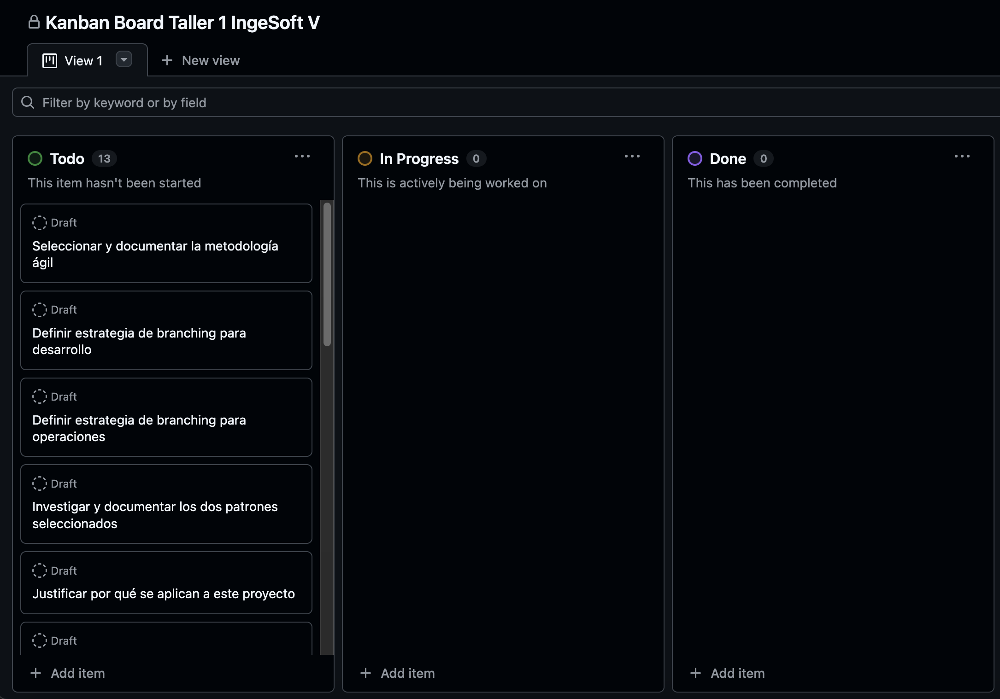

# 📌 Metodología Ágil, Estrategia de Branching y Estándar de Commits

## 1. Metodología Ágil Seleccionada: **Kanban**

Para este proyecto se seleccionó la metodología **Kanban**, dado que:

* Permite **visualizar el flujo de trabajo** mediante un tablero con columnas (*To Do – In Progress – Done*).
* Es flexible y se adapta a cambios, sin requerir iteraciones rígidas como Scrum.
* Facilita la **gestión continua** de tareas en paralelo para desarrollo y operaciones.
* Su simplicidad es ideal para un taller académico con tiempos cortos de entrega.

En GitHub, el flujo se gestiona con **Projects (tablero Kanban)**, donde cada *issue* o *draft item* se mueve entre columnas conforme avanza:

* **To Do** → tareas pendientes.
* **In Progress** → tareas en ejecución.
* **Done** → tareas completadas.
* 



---

## 2. Estrategias de Branching (con Hotfix)

### 🔹 Desarrollo (Dev Team) – Git Flow simplificado

* **main** → rama protegida, siempre lista para producción.
* **develop** → integración continua, desplegada en *staging*.
* **feature/<ticket>** → nuevas funcionalidades o fixes menores.
* **hotfix/<issue>** → correcciones críticas que van directo a `main` (ejemplo: bug grave en producción).

**Flujo típico (feature):**
```bash
git checkout -b feature/login
git push origin feature/login
# abrir PR -> revisión -> merge a develop
```

**Flujo típico (hotfix prod):**

```bash
git checkout -b hotfix/fix-auth
git push origin hotfix/fix-auth
# abrir PR -> merge directo a main (y cherry-pick a develop si aplica)
```

---

### 🔹 Operaciones / Infra (Ops Team) – Git Flow para Infra

* **ops/main** → infraestructura actual de producción (estado real).
* **ops/feature/<cambio>** → propuesta de cambio infra (ejemplo: crear cluster EKS, añadir Redis).
* **ops/hotfix/<issue>** → correcciones urgentes de infraestructura (ejemplo: aumentar tamaño de RDS, cambiar regla de seguridad).

**Flujo típico (hotfix infra):**

```bash
git checkout -b ops/hotfix/fix-security-group
git push origin ops/hotfix/fix-security-group
# abrir PR -> verificación rápida -> merge a ops/main -> terraform apply
```

---


## 3. Estándar de Commits

Se adopta el estándar **Conventional Commits** para mantener un historial claro y automatizable:

* `feat`: nueva funcionalidad.
* `fix`: corrección de bug.
* `docs`: cambios en documentación.
* `style`: formato/código sin afectar lógica.
* `refactor`: cambio interno sin añadir funcionalidad.
* `test`: añadir o modificar pruebas.
* `chore`: tareas de mantenimiento (dependencias, configs, etc.).

**Ejemplos:**

```bash
feat: añadir pipeline de CI con GitHub Actions
fix: corregir error en Dockerfile de microservicio auth
docs: agregar sección de estrategia de branching en la documentación
```

---

## 4. Reglas generales de protección de ramas

Para mantener la seguridad y trazabilidad del repositorio:

* Evitar push directo a ramas críticas.
* Usar Pull Requests para mergear cambios importantes.
* Validar que los commits sigan la convención de **Conventional Commits**.
* Revisar cambios antes de mergear (al menos 1 revisor recomendado).
* Para efectos del taller, **solo se protegió la rama `main`** para evitar cambios accidentales.


